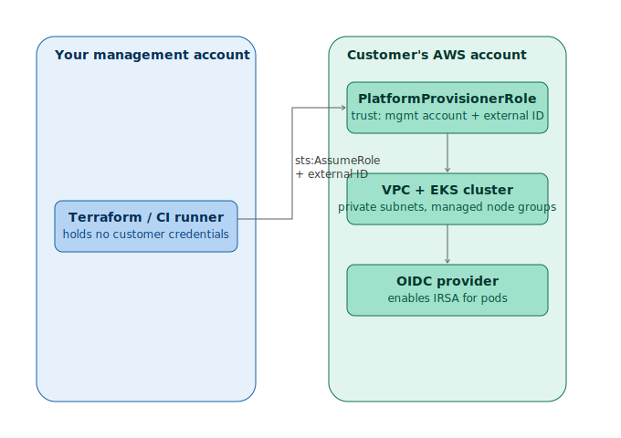

# eks-cross-account-terraform

[](https://github.com/KaloshevD/eks-cross-account-terraform/actions/workflows/terraform-validate.yml)

Terraform modules for provisioning EKS clusters **into customer-owned AWS accounts**, using
cross-account IAM roles instead of shared credentials - the pattern real MSPs, SaaS vendors,
and platform teams use when they manage infrastructure they don't own.

## Why this exists

Most EKS Terraform demos assume you're deploying into your own account. In practice, a
platform/security team is often provisioning infrastructure inside a *customer's* AWS account -
which means you can't just hand over root credentials. This repo shows the actual pattern for
that: the customer creates a narrowly-scoped, revocable IAM role that trusts your account; you
assume that role via STS to run Terraform against their environment.

## Architecture



1. The customer applies `modules/customer-account-role` in their own account. This creates an
   IAM role trusting only your management account's ID, further locked down with an
   `sts:ExternalId` condition (protects against the confused-deputy problem).
2. Your platform assumes that role via a Terraform provider `assume_role` block - no shared
   credentials, no long-lived customer keys anywhere in your systems.
3. Using that temporary, scoped session, `modules/eks-cluster` provisions a VPC and an EKS
   cluster with managed node groups (and optionally Fargate profiles) inside the customer's
   account.
4. An OIDC provider is created alongside the cluster, enabling IRSA (IAM Roles for Service
   Accounts) - the mechanism a later project (a custom Kubernetes operator) uses to get
   pod-scoped AWS permissions instead of broad node-level access.

See [ARCHITECTURE.md](ARCHITECTURE.md) for the full trust model, failure modes, and design
rationale.

## Repo layout

```
modules/
  customer-account-role/   # applied BY THE CUSTOMER, in their account
  eks-cluster/              # applied BY THE PLATFORM, via an assumed role
examples/
  customer-role-setup/      # standalone example of step 1
  full-deployment/           # standalone example of steps 2-4, incl. the assume_role provider
docs/diagrams/               # architecture diagrams
```

## Quick start

**As the customer**, in your own AWS account:
```bash
cd examples/customer-role-setup
cp terraform.tfvars.example terraform.tfvars
# edit terraform.tfvars: set management_account_id, generate external_id with `openssl rand -hex 16`
terraform init
terraform apply
# send the `role_arn` output to your platform provider; share external_id out-of-band
```

**As the platform**, once you have the customer's `role_arn` and `external_id`:
```bash
cd examples/full-deployment
cp terraform.tfvars.example terraform.tfvars
# edit terraform.tfvars: set customer_role_arn, customer_name, external_id
terraform init
terraform apply
# configure kubectl using the printed `configure_kubectl` output
```

## Key design decisions

- **External ID, not just account ID, in the trust policy.** Account ID alone in a trust policy
  is vulnerable to the confused-deputy problem - a third party could trick the management
  account into assuming a role on their behalf if it also happened to match. A per-customer
  external ID closes that gap.
- **No `AdministratorAccess`.** The customer-side role is granted a scoped policy - EKS, the
  specific EC2/VPC networking actions needed, IAM actions limited to `eks-*` prefixed resources,
  and the KMS/CloudWatch permissions needed for encryption and logging. A security-conscious
  customer reviewing this in procurement should be able to read exactly what they've granted
  without needing to trust a blanket managed policy.
- **Providers are the caller's responsibility.** `modules/eks-cluster` doesn't hardcode an
  `assume_role` block - it accepts whatever provider the caller passes in. That means the same
  module works for cross-account deployments (this repo's main use case) and plain
  single-account deployments, without duplicating code.
- **Secrets encryption + audit logging on by default.** `cluster_encryption_config` for
  Kubernetes secrets at rest, and API/audit/authenticator log types shipped to CloudWatch -
  defaults a security engineer would actually want, not just what makes `terraform apply`
  succeed fastest.
- **IRSA enabled by default.** The OIDC provider is nearly free to create and is a prerequisite
  for doing IAM access properly at the pod level later - worth enabling even before you have a
  workload that needs it.

## What I'd do differently at scale

- The customer-side policy is scoped by name prefix (`eks-*`) rather than by tag-based
  `aws:ResourceTag` conditions - name-prefix scoping is simpler to read but slightly easier to
  work around than tag-based conditions combined with SCPs. At scale I'd move to tag-based
  conditions plus an AWS Organizations SCP as a second layer of defense.
- State is left to the caller (no backend is hardcoded) - in production this would be an S3
  backend with per-customer state isolation and DynamoDB locking, provisioned in the management
  account, not the customer's.
- No automated external ID generation/rotation workflow yet - right now it's a manual
  `openssl rand -hex 16` step. A real onboarding flow would generate and store this in a secrets
  manager automatically.

## Related projects

This is part of a small platform-engineering series:
- **This repo** - cross-account Terraform for EKS
- Helm charts for baseline cluster security tooling (Trivy/Falco + OPA Gatekeeper)
- A custom Kubernetes operator using IRSA for scoped AWS access

## License

MIT - see [LICENSE](LICENSE).
